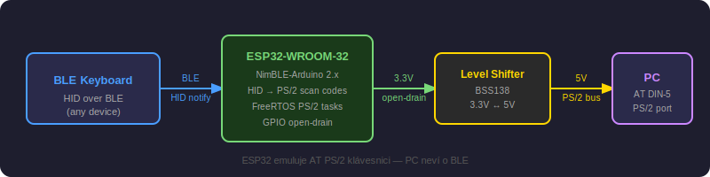
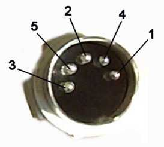
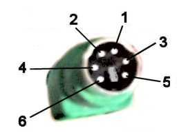
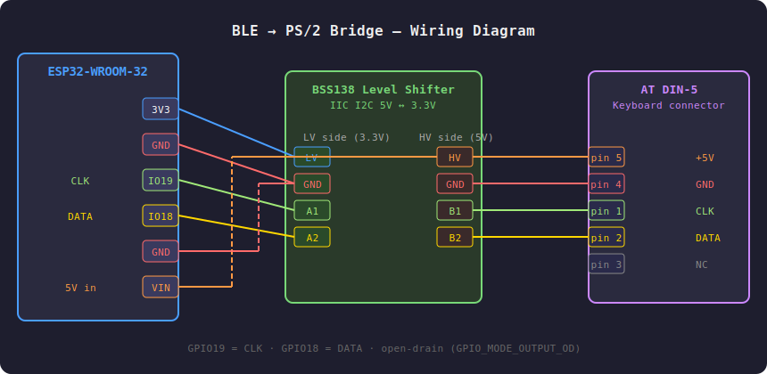
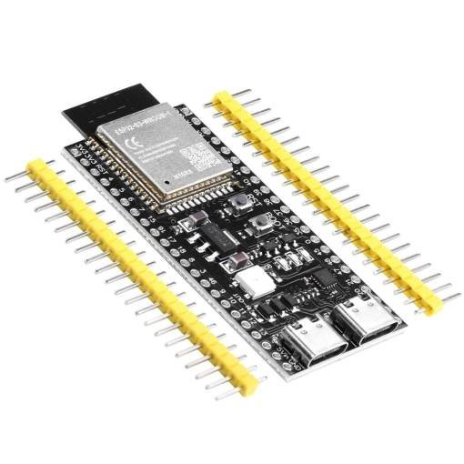
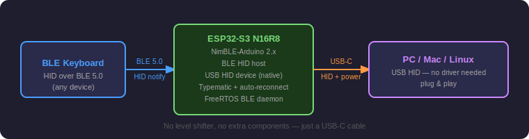
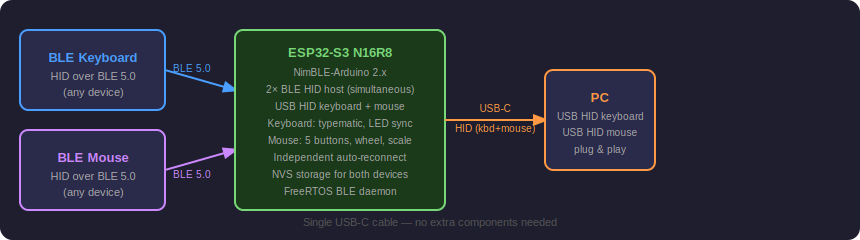
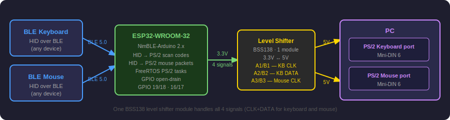
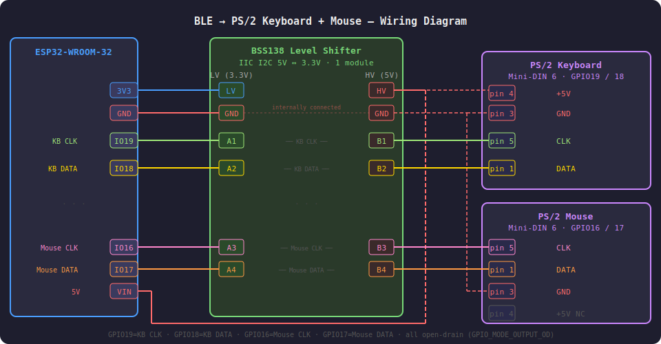

# BLE → PS/2 AT Keyboard Bridge

> ESP32 firmware that acts as a **PS/2 AT keyboard emulator** — connects to any BLE HID keyboard and forwards keystrokes to a PC via the PS/2 port.

Ideal for retro PCs, vintage hardware, industrial machines or any device with an AT DIN-5 or PS/2 keyboard port that you want to use with a modern wireless keyboard.

---

## Block Diagram



---

## Features

- **BLE HID host** — connects to any Bluetooth LE keyboard (NimBLE-Arduino 2.x)
- **PS/2 AT emulator** — full scan code set 2, open-drain bus, FreeRTOS tasks
- **Typematic** — key repeat with 500 ms initial delay, 20 keys/s rate
- **Scan-before-connect** — waits for keyboard to start advertising before attempting connection, eliminates blind retry loops
- **Auto-reconnect** — BLE daemon task (Core 0) detects disconnection, scans until device is seen advertising, then connects immediately; `loop()` on Core 1 is never blocked
- **Battery level** — reads and displays keyboard battery percentage if supported
- **BIOS compatible** — responds to all POST commands including `GET_DEVICE_ID` (0xF2 → `0xAB 0x83`)
- **Serial console** — `scan` / `connect` / `forget` / `status` commands at 115200 baud
- **LED sync** — NumLock / CapsLock / ScrollLock state forwarded back to the BLE keyboard so indicators stay in sync
- **Battery shortcut** — press **LCtrl+LAlt+PrintScreen** to type the keyboard battery percentage (e.g. `78%`)
- **Status shortcut** — press **LCtrl+LAlt+LShift+PrintScreen** to type the full bridge status into any text field
- **NVS storage** — paired keyboard remembered across reboots
- **Keepalive** — periodic battery read every 30 s keeps the BLE keyboard awake; runs in `bleDaemonTask` on Core 0 so it never blocks PS/2 timing; result discarded — battery value is maintained exclusively by the BLE notification callback
- **WiFi disabled** — WiFi stack is deinitialised at startup, saving ~20 mA
- **HID report format auto-detection** — handles both standard 8-byte reports (with reserved byte) and compact 7-byte reports (reserved byte omitted) transparently
- **Persistent connect** — `connect` retries up to 20 times with 500 ms gaps; press any key in Serial Monitor to abort
- **No byte drops** — send task retries every byte until acknowledged; multi-byte sequences (E0 + scancode) are never left incomplete
- **Game-safe timing** — 100 ms clock-inhibit tolerance covers slow IRQ1 handlers in DOS games (Tyrian, Duke 3D, etc.)
- **Permanent power** — when powered from the PS/2 port the ESP32 stays on across PC reboots; the host task detects PC power-on by measuring clock-inhibit duration (≥ 2 s) and automatically re-sends BAT

---

## Hardware

### Components

| Component | Description |
|-----------|-------------|
| ESP32-WROOM-32 (MH-ET LIVE MiniKit) | Main microcontroller |
| BSS138 bidirectional level shifter | 3.3 V ↔ 5 V logic translation |
| AT DIN-5 male connector | Keyboard port on PC motherboard |

### Connectors

#### AT DIN-5 (used in this project)



| Pin | Signal | Description |
|-----|--------|-------------|
| 1 | CLK | Keyboard clock |
| 2 | DATA | Keyboard data |
| 3 | RESET | Not used |
| 4 | GND | Ground |
| 5 | +5V | Power |

#### PS/2 Mini-DIN 6 (alternative — note different pinout!)



| Pin | Signal | Description |
|-----|--------|-------------|
| 1 | DATA | Keyboard data |
| 2 | — | Not used |
| 3 | GND | Ground |
| 4 | +5V | Power |
| 5 | CLK | Keyboard clock |
| 6 | — | Not used |

> ⚠️ **Note:** CLK and DATA are **swapped** between DIN-5 and Mini-DIN 6. If switching connector types, swap GPIO18 and GPIO19 in the code or rewire at the level shifter.

### Level Shifter


The BSS138-based bidirectional level shifter translates between ESP32's 3.3 V GPIO and the PC's 5 V PS/2 bus. It has built-in pull-up resistors on both sides — **no external resistors needed**. The LV GND and HV GND are connected internally on the module.

The module has two sides:
- **LV side** — connect to ESP32 (3.3 V logic)
- **HV side** — connect to PS/2 port (5 V logic)

---

### Wiring Diagram



#### Step-by-step connections

| ESP32 pin | Level shifter | DIN-5 pin | Signal |
|-----------|--------------|-----------|--------|
| 3V3 | LV | — | 3.3 V reference for LV side |
| VIN (5V) | HV | pin 5 | 5 V reference for HV side + power |
| GND | GND (both) | pin 4 | Common ground |
| GPIO19 | A1 → B1 | pin 1 | CLK |
| GPIO18 | A2 → B2 | pin 2 | DATA |
| — | — | pin 3 | Not connected |

> 💡 **Why a level shifter?** PS/2 is a 5 V open-collector bus. ESP32 GPIO is 3.3 V tolerant max. A simple voltage divider pulls idle CLK/DATA lines too low, causing the PC to see them as permanently asserted (inhibit state). The BSS138 level shifter correctly translates logic levels while maintaining open-drain behaviour.

> 💡 **Open-drain GPIO:** The firmware configures CLK and DATA as `GPIO_MODE_OUTPUT_OD` (open-drain). Driving LOW pulls the line down, releasing to INPUT allows the pull-up to float it HIGH — exactly as required by the PS/2 protocol.

---

## Software

### Requirements

| Tool | Version |
|------|---------|
| Arduino IDE | 2.x |
| ESP32 Arduino core | ≥ 3.x |
| NimBLE-Arduino | 2.x |

### Installation

1. Install **ESP32 Arduino core** via Boards Manager
2. Install **NimBLE-Arduino** via Library Manager
3. Open `ble_ps2_bridge.ino` in Arduino IDE
4. Select board: **ESP32 Dev Module** (or **MH ET Live ESP32MiniKit**)
5. Upload

### Configuration

At the top of the sketch:

```cpp
#define PS2_CLK_PIN   19    // CLK GPIO
#define PS2_DAT_PIN   18    // DATA GPIO

#define TYPEMATIC_DELAY_MS  500   // ms before key repeat starts
#define TYPEMATIC_RATE_MS    50   // ms between repeats (50 = 20 keys/s)
```

---

## Usage

Connect via **Serial monitor at 115200 baud**.

### First-time pairing

```
scan                        # scan BLE devices for 10 seconds
                            # put keyboard in pairing mode first
  MyKeyboard  aa:bb:cc:dd:ee:ff

connect aa:bb:cc:dd:ee:ff   # connect and save
```

### Commands

| Command | Description |
|---------|-------------|
| `scan` | Scan BLE 10 s, show named devices |
| `connect <mac>` | Connect to MAC address and save (up to 20 attempts; press any key to abort) |
| `forget` | Clear saved keyboard and all bonds |
| `status` | Show full connection info, NVS data, battery level |
| `help` | Show command list |

### Status output

```
--- BLE-PS2 Bridge status ---
BLE:      CONNECTED
Peer MAC: dc:35:77:e9:cf:a1
RSSI:     -52 dBm
Interval: 48 ms
Encrypt:  yes
Bonded:   yes
Battery:  78%

NVS MAC:  dc:35:77:e9:cf:a1
Bonds:    1
-----------------------------
```

Battery is shown only if the keyboard supports the BLE Battery Service (UUID 0x180F). If not supported, `Battery: unknown` is displayed.

### Keyboard shortcuts

| Combination | Output |
|-------------|--------|
| **LCtrl + LAlt + PrtSc** | Battery percentage |
| **LCtrl + LAlt + LShift + PrtSc** | Full bridge status block |

Both shortcuts type into whatever text field has focus — Notepad, terminal, browser address bar, etc. They work without access to the Serial monitor.

Only **Left** modifier keys are recognised. The bridge releases all held modifier keys and stops typematic before typing the output, so the text is not corrupted by Ctrl/Alt being held on the PC side.

**LCtrl + LAlt + PrtSc** example output:
```
78%
```

**LCtrl + LAlt + LShift + PrtSc** example output:
```
--- BLE-PS2 Bridge status ---
BLE:      CONNECTED
Peer MAC: dc:35:77:e9:cf:a1
RSSI:     -52 dBm
...
-----------------------------
```

### Lock key LED synchronisation

NumLock, CapsLock and ScrollLock indicator LEDs on the BLE keyboard stay in sync with the PC state automatically.

In the **PS/2 variant**, the PC sends a `0xED` LED command to the bridge whenever lock state changes. The bridge remaps the bitmask (PS/2 and BLE HID use different bit order) and writes it to the BLE keyboard's HID Output Report characteristic.

In the **USB variant**, the PC sends a USB HID Output Report directly. Since Arduino core does not expose this callback, the bridge tracks lock key toggle events locally and updates the BLE keyboard accordingly.

| PS/2 bit | BLE HID bit | Key |
|----------|------------|-----|
| bit 1 | bit 0 | NumLock |
| bit 2 | bit 1 | CapsLock |
| bit 0 | bit 2 | ScrollLock |

### Automatic reconnect

When the keyboard disconnects, `bleDaemonTask` sets `kbReconnectScan = true` and starts a continuous BLE scan (`duration = 0`). As soon as `onDiscovered` sees the keyboard advertising, it clears the scan flag and sets `kbReconnectAt = now + 50 ms`. The daemon fires within 100 ms and calls `tryConnectKb()` — a blocking call of up to 5 s, but running on Core 0 at priority 2 it is preempted by the PS/2 tasks at any moment. `loop()` on Core 1 is never stalled.

On boot with a saved MAC, the firmware delays the first scan by **1.5 s**. This avoids running BLE scan concurrently with the PS/2 BIOS initialisation window — the BIOS sends `0xFF` Reset to keyboard and mouse within the first ~1 s of power-on. When the ESP32 and PC are powered from the same PS/2 rail they start simultaneously; the delay ensures the PS/2 BAT exchange completes cleanly before RF activity begins.

---

## PS/2 Protocol Implementation

### Startup sequence

On boot the firmware calls `keyboard.begin()` as the very first action in `setup()` — before `Serial.begin()`, before WiFi deinit, before anything else. This ensures **BAT (Basic Assurance Test) `0xAA`** reaches the PC within ~200 ms of power-on. BIOS waits up to ~500 ms for this byte; the previous order (`Serial.begin` + `delay(200)` + WiFi deinit first) consumed ~400 ms before BAT was sent, causing rare `Keyboard error` failures on slow boots.

The `ps2_write(0xAA)` call in `begin()` uses a retry loop — if the bus is INHIBITED at that moment (PC still initialising its 8042 controller), the byte is retried until the bus is IDLE.

#### Permanent power — PC reboot detection

When the ESP32 is powered permanently from the PS/2 port it does not reset when the PC reboots or cold-boots. Without special handling `keyboard.begin()` only runs once and the PC never receives BAT on subsequent boots.

The host task monitors how long the bus stays INHIBITED. A powered-off PC holds CLK low for seconds; normal 8042 clock-inhibit (between bytes) lasts less than 100 ms. When INHIBITED lasts ≥ 2 s and the bus then returns to IDLE, the firmware treats this as a PC power-on event and re-sends BAT automatically — identical behaviour to a fresh ESP32 boot.

### Host command handling

| Command | Response | Notes |
|---------|----------|-------|
| `0xFF` RESET | `0xFA` + `0xAA` | Re-enables data reporting |
| `0xF2` GET_DEVICE_ID | `0xFA` + `0xAB` + `0x83` | **Critical** — BIOS identifies keyboard type |
| `0xED` SET LEDs | `0xFA` + read byte + `0xFA` | NumLock/CapsLock/ScrollLock |
| `0xF3` Typematic rate | `0xFA` + read byte + `0xFA` | Accepted, not applied |
| `0xF0` Scan code set | `0xFA` + read byte + `0xFA` | Always set 2 |
| `0xF4` Enable reporting | `0xFA` | |
| `0xF5` Disable reporting | `0xFA` | |
| `0xEE` Echo | `0xEE` | |
| `0xFE` Resend | `0xFA` | |
| default | `0xFA` | |

### HID report format

BLE HID keyboards send reports in two formats depending on firmware. The bridge auto-detects which format is in use:

| Length | Format | Keys offset |
|--------|--------|-------------|
| 8 bytes | `[mod][0x00][key1..key6]` — standard, reserved byte present | `data + 2` |
| 7 bytes | `[mod][key1..key6]` — compact, reserved byte omitted | `data + 1` |

The heuristic is `len == 8 && data[1] == 0x00` → standard format; otherwise compact. Up to 6 simultaneous keys are processed in both cases.

### FreeRTOS architecture

```
Core 0                              Core 1
──────────────────────────────      ──────────────────────────────
BLE stack (NimBLE)                  loop() (Arduino default)
  └─ notifyCallback()                 handleSerial() — non-blocking
       └─ keyboard.keyHid_send()      typematic, LED forward
            └─ xQueueSend()           UART RX interrupts live here
                                      processMouseMovement() — always runs

ps2send task  (priority 15, Core 0)
  xQueueReceive() → ps2_write()
  retry loop — never drops a byte

ps2host task  (priority 8, Core 0)
  checks CLK/DATA every 2 ms
  → reply_to_host()

bleDaemonTask (priority 2, Core 0)
  polls every 100 ms
  keepalive readValue() — result discarded
  scan-first reconnect: waits for device to advertise,
    then connects (never blocks loop())
  boot: delays scan 1.5 s to clear PS/2 BIOS init window
```

The send task runs on **Core 0 at priority 15**. `ps2_write()` uses `taskENTER_CRITICAL` which masks interrupts on its core — running on Core 0 means UART RX interrupts on Core 1 are never affected. The BLE daemon also runs on Core 0 at priority 2; PS/2 tasks (pri 15 and 8) preempt it freely during any blocking BLE `connect()` or `readValue()` call. `loop()` on Core 1 is **never blocked by BLE operations**, which eliminates input-drop issues in tight-polling DOS games like Tyrian.

### Timing constants

| Constant | Value | Notes |
|----------|-------|-------|
| CLK half period | 40 µs | PS/2 spec (30–50 µs) |
| Byte interval | 500 µs | Gap between bytes in a packet |
| Host poll interval | 2 ms | Checks CLK/DATA for host commands |
| `ps2_write_wait_idle` timeout | 100 ms | Waits for 8042 clock release; covers slow IRQ1 handlers in DOS games; uses `vTaskDelay(1)` to feed watchdog |
| BLE connection interval | 7.5 ms | Fixed (min=max=6 units) — lowest available BLE latency |
| Supervision timeout | 32 s | BLE connection parameter |
| Keepalive interval | 30 s | Battery read in bleDaemonTask — result discarded, value comes from notification |

---

## Troubleshooting

| Symptom | Cause | Fix |
|---------|-------|-----|
| *Keyboard error or not present* | BAT not received within BIOS timeout | Fixed — `keyboard.begin()` is the first call in `setup()`, BAT uses retry loop, and host task re-sends BAT after PC power-on while ESP32 is running. If it still occurs, check level shifter wiring and 5 V on HV side |
| BIOS OK but OS fails | Supervision timeout during POST | Already fixed — supervision = 32 s |
| Keys not repeating | — | Typematic implemented in firmware |
| Wrong keys | Wrong pin assignment | DIN-5: pin1=CLK, pin2=DATA. Mini-DIN 6: pin5=CLK, pin1=DATA |
| Can't connect BLE | Keyboard not in pairing mode | Use `forget` then `scan`, put keyboard into pairing mode |
| Connects but no input | Wrong HID report format | Check Serial log — `[HID]` lines should appear on keypress |
| Reconnect takes a while | Keyboard not advertising yet | Normal — firmware scans and waits, connects as soon as keyboard is visible |
| Lock key LEDs wrong | Bridge just connected | Press the lock key once to resync state |
| 5–10 s input delay after idle | Keyboard entered BLE sleep | Fixed by keepalive — if it persists, reduce `KEEPALIVE_MS` |
| Stuck keys / wrong key in games | IRQ1 handler inhibits clock longer than old 1.5 ms timeout | Fixed — timeout is now 100 ms with `vTaskDelay(1)` retry; no byte is ever dropped |
| Input lag in tight-polling games (Tyrian, etc.) | `readValue()` blocking `loop()` | Fixed — keepalive moved to `bleDaemonTask` on Core 0; result discarded |
| Serial console stops responding after keyboard connects | PS/2 `taskENTER_CRITICAL` masking UART RX on Core 1 | Fixed — PS/2 send tasks run on Core 0; UART RX on Core 1 is never masked |
| Battery shows wrong value | BLE device reports stale value via `readValue()` | Fixed — battery value comes exclusively from BLE notification callback |

---

## Credits & References

- PS/2 protocol implementation based on [esp32-bt2ps2](https://github.com/hamberthm/esp32-bt2ps2) by Humberto Mockel
- PS/2 scan codes: [computer-engineering.org](http://www.computer-engineering.org/ps2keyboard/scancodes2.html)
- AT/PS2 connector pinout: [5kw.dk](https://5kw.dk/Hobby/electronics/connectors/at_keyboard_connector.htm)

---

## License

MIT

---

---

# Variant 2 — BLE → USB HID Keyboard (ESP32-S3 N16R8)

BLE keyboard → **USB HID keyboard** using the native USB interface of the ESP32-S3. No level shifter, no PS/2 cable — a single USB-C cable both powers the module and carries HID data.

## Hardware

### ESP32-S3 N16R8



| Parameter | Value |
|-----------|-------|
| SoC | ESP32-S3 |
| Flash | 16 MB |
| PSRAM | 8 MB (Octal) |
| BLE | 5.0 (NimBLE) |
| WiFi | 802.11 b/g/n |
| USB | Native USB OTG (no CH340) |
| Dimensions | 51 × 25 mm |

> The ESP32-S3 has **native USB** built into the chip — it can present itself as a USB HID device without any converter. BLE HID keycodes (Usage Page 0x07) are identical to USB HID keycodes, so forwarding is direct with no translation table.

### Wiring

```
BLE Keyboard  ──(BLE 5.0)──►  ESP32-S3  ──(USB-C)──►  PC
```

**No extra components.** A single USB-C cable provides both power and HID output to the PC.

### USB ports on the ESP32-S3 devkit

The devkit has two USB-C ports:

| Port | Chip | Use |
|------|------|-----|
| UART | CH340 / CP2102 | Upload firmware, Serial Monitor debug |
| USB-OTG | Native ESP32-S3 | HID output to PC (keyboard) |

Both can be connected simultaneously. Use the UART port for Arduino IDE uploads and the USB-OTG port for the target PC.

## Block Diagram



## Software — `ble_usb_bridge_s3.ino`

### Arduino IDE Settings

| Setting | Value |
|---------|-------|
| Board | **ESP32S3 Dev Module** |
| USB Mode | **USB-OTG (TinyUSB)** ← required! |
| USB CDC On Boot | Disabled |
| Flash Size | 16MB |
| PSRAM | OPI PSRAM |
| Upload Mode | UART0 / USB-CDC |

> ⚠️ **USB Mode must be set to `USB-OTG (TinyUSB)`** — without this USB HID will not work. Set it in the `Tools` menu in Arduino IDE.

### Required Libraries

| Library | Source |
|---------|--------|
| NimBLE-Arduino 2.x | Library Manager |
| USB.h + USBHIDKeyboard.h | included in ESP32 Arduino core 3.x |

### How It Works

```
notifyCallback()          ← BLE HID notify from keyboard
  └─ processHIDReport()
       ├─ usbApplyModifiers(mod)   → hidKb.pressRaw() / releaseRaw() per bit (always, not just on change)
       ├─ LED sync (lock keys)     → checked before prevKeys overwrite to detect edge correctly
       ├─ usbKeyUp(keycode)        → hidKb.releaseRaw(keycode)
       └─ usbKeyDown(keycode)      → hidKb.pressRaw(keycode)

loop()
  └─ Typematic: hidKb.pressRaw(typematicKey) every 50 ms after 500 ms hold
     typematic variables are volatile — safe across Core 0 write / Core 1 read
  └─ statusRequested: typeStatusViaUSB() on Ctrl+Alt+PrintScreen

bleDaemonTask (FreeRTOS, core 0)
  └─ check every 3 s → hidKb.releaseAll() + scan-before-connect
  └─ keepalive readValue() — result discarded, battery from notification
```

Since the BLE HID Usage Table (Keyboard/Keypad, Usage Page 0x07) is identical to USB HID, keycodes are forwarded directly without a translation table.

### HID report format

Same auto-detection as the PS/2 variant — handles both 8-byte (reserved byte present) and 7-byte (reserved byte omitted) keyboard reports transparently. See the [HID report format](#hid-report-format) section above for details.

### Comparison with PS/2 Variant

| | Variant 1 (PS/2) | Variant 2 (USB keyboard) |
|--|------------------|--------------------------|
| Hardware | ESP32-WROOM-32 + level shifter | ESP32-S3 |
| Output | AT DIN-5 / PS/2 | USB-C HID |
| Extra components | BSS138 level shifter | None |
| Power | 5V from PS/2 or USB | USB-C cable |
| Compatibility | Retro PC, industrial | Modern PC, Mac, Linux |
| BIOS POST | ✅ (BAT 0xAA, GET_DEVICE_ID) | ✅ (USB enumeration) |
| Key codes | PS/2 Set 2 | USB HID Usage |
| Driver | None (PS/2 native) | None (HID plug & play) |
| WiFi disabled | ✅ saves ~20 mA | — |
| Battery level | ✅ | ✅ |
| LCtrl+LAlt+PrtSc → battery % | ✅ | ✅ |
| LCtrl+LAlt+LShift+PrtSc → status | ✅ via PS/2 | ✅ via USB HID |
| LED sync | ✅ via 0xED forward | ✅ via toggle tracking |

### Serial Console

Debug output goes through **UART0** (UART port on the devkit) — independent of the USB HID port.

| Command | Description |
|---------|-------------|
| `scan` | Scan BLE HID devices 10 s, show MAC / type / RSSI / name |
| `connect <mac>` | Connect and save — persistent retry until success (max 20 attempts) |
| `forget` | Clear saved keyboard and all bonds |
| `status` | Show connection info and settings |
| `help` | Show command list |
| `cdc on/off` | Enable / disable USB CDC console (UART only; reboot to apply) |

`connect` retries up to 20 times automatically. Keep the keyboard in pairing mode until `[NVS] Saved` appears. Press any key in the Serial Monitor to abort.

### USB CDC console (optional)

The firmware can present a **virtual serial port** (USB CDC) on the same USB-C HID cable, creating a composite USB device (HID keyboard + CDC serial). This allows configuring the bridge without a separate UART cable.

**Disabled by default.** To enable:

```
cdc on       ← type in UART Serial Monitor
             ← reboot — a COM port now appears alongside the HID keyboard
```

To disable:
```
cdc off      ← type in UART Serial Monitor
             ← reboot
```

The `cdc on/off` command is **UART-only** — it cannot be issued from the CDC console itself. The setting is saved to NVS and survives reboots. When CDC is disabled, the USB descriptor contains only the HID keyboard interface and no COM port is visible to the OS.

#### Windows XP CDC driver

Windows XP does not include a CDC driver for composite USB devices — it requires a `.inf` file to install `usbser.sys` for the CDC interface. Two INF files are included in the project:

| File | Purpose |
|------|---------|
| `esp32s3_composite.inf` | Installs USB Composite Device driver (`usbccgp.sys`) for the parent device |
| `esp32s3_cdc.inf` | Installs USB Serial driver (`usbser.sys`) for the CDC interface |

**Installation procedure on Windows XP:**

1. Enable CDC on the bridge and reboot (`cdc on` via UART, then power-cycle)
2. Connect the USB-C HID+CDC cable to the XP PC
3. The New Hardware Wizard appears — **cancel it** (do not let Windows search online)
4. Open **Device Manager** — you will see a yellow question mark

**Step A — check if composite device was recognised automatically:**

- If Device Manager shows **ESP32-S3 USB OTG** with a yellow `!` *and* a separate **TinyUSB CDC** entry → XP already loaded `usbccgp.sys` automatically. Skip to Step B.
- If only a single yellow `?` appears with Hardware ID `USB\VID_303A&PID_1001` → install `esp32s3_composite.inf` first:
  - Right-click the unknown device → **Update Driver** → Install from specific location → point to the folder containing `esp32s3_composite.inf`
  - Confirm the unsigned driver warning
  - Device Manager should now show the CDC interface separately

**Step B — install CDC serial driver:**

- Right-click **ESP32-S3 USB OTG** (Hardware ID `USB\VID_303A&PID_1001&MI_01`) → **Update Driver**
- Install from specific location → point to the folder containing `esp32s3_cdc.inf`
- Confirm the unsigned driver warning
- The device now appears as **COM port** (e.g. COM3) under Ports in Device Manager

**Notes:**

- The VID (`303A`) and PID (`1001`) are fixed in the ESP32 Arduino core and are the same on every ESP32-S3 board — the INF files work on any XP PC without modification
- The CDC interface is on **MI_01** in the composite descriptor (HID keyboard = MI_00, CDC = MI_01)
- On Windows 7 and later, `usbser.sys` loads automatically — no INF file needed
- If the driver installation fails, try a different USB port; XP caches device information per port


### Configuration

```cpp
#define TYPEMATIC_DELAY_MS   500   // ms before repeat starts
#define TYPEMATIC_RATE_MS     50   // ms between repeats (20 keys/s)
```

---

---

# Variant 3 — BLE → USB HID Keyboard + Mouse (ESP32-S3 N16R8)

BLE keyboard **and** BLE mouse → **USB HID keyboard + mouse** simultaneously, via a single USB-C cable. Both devices connect independently over BLE and are forwarded as standard USB HID. No extra hardware needed.

## Block Diagram



## Hardware

Same ESP32-S3 N16R8 module as Variant 2. No additional components.

```
BLE Keyboard ──(BLE 5.0)──┐
                          ├──► ESP32-S3 ──(USB-C)──► PC
BLE Mouse    ──(BLE 5.0)──┘     kbd + mouse HID
```

## Features

- **Two simultaneous BLE connections** — keyboard and mouse connected independently
- **USB HID keyboard** — full typematic, LED sync, hotkeys (same as Variant 2)
- **USB HID mouse** — movement, scroll wheel, 5 buttons (Left, Right, Middle, Back, Forward)
- **Mouse DPI scaling** — configurable divisor to adjust cursor speed for high-DPI mice
- **Scroll wheel inversion** — toggle with `flipw`
- **Y-axis inversion** — toggle with `flipy`
- **Report ID filter** — set a specific BLE Report ID for mice with multiple HID characteristics
- **Independent auto-reconnect** — each device reconnects separately without affecting the other
- **NVS storage** — both device MACs and all mouse settings saved across reboots
- **Battery shortcut** — **LCtrl+LAlt+PrintScreen** types both battery levels: `K: 80% M: 95%`
- **Status shortcut** — **LCtrl+LAlt+LShift+PrintScreen** types full status for both devices

## Software — `ble_usb_kb_mouse_bridge_s3.ino`

### Arduino IDE Settings

Same as Variant 2:

| Setting | Value |
|---------|-------|
| Board | **ESP32S3 Dev Module** |
| USB Mode | **USB-OTG (TinyUSB)** ← required! |
| USB CDC On Boot | Disabled |
| Flash Size | 16MB |
| PSRAM | OPI PSRAM |

### Required Libraries

| Library | Source |
|---------|--------|
| NimBLE-Arduino 2.x | Library Manager |
| USB.h + USBHIDKeyboard.h + USBHIDMouse.h | included in ESP32 Arduino core 3.x |

### Serial Console Commands

| Command | Description |
|---------|-------------|
| `scan` | Scan BLE HID devices 10 s — shows Keyboard / Mouse / type |
| `connect kb <mac>` | Connect BLE keyboard, persistent retry until success, save to NVS |
| `connect mouse <mac>` | Connect BLE mouse, persistent retry until success, save to NVS |
| `forget kb` | Forget saved keyboard |
| `forget mouse` | Forget saved mouse |
| `forget all` | Forget both devices and reset all settings to defaults |
| `scale <1-64>` | Mouse movement divisor (default 4) |
| `flipy` | Toggle mouse Y-axis inversion |
| `flipw` | Toggle scroll wheel direction |
| `reportid <0-255>` | Mouse BLE Report ID filter (0 = auto) |
| `status` | Show connection status and all settings |
| `help` | Show command list |
| `cdc on/off` | Enable / disable USB CDC console (UART only; reboot to apply) |

`connect kb` and `connect mouse` both retry up to 20 times automatically. Keep each device in pairing mode until saved. Use separate `connect` calls — pairing one device does not affect the other.

### First-time setup

Put each device into **pairing/discoverable mode** before scanning.

```
scan
  #1   aa:bb:cc:dd:ee:ff  Keyboard   -61 dBm  MyKeyboard
  #2   db:81:f4:bb:6b:5e  Mouse      -55 dBm  MX Master 3

connect kb aa:bb:cc:dd:ee:ff
connect mouse db:81:f4:bb:6b:5e
```

Each `connect` command saves the device to NVS. On next boot both devices reconnect automatically.

### Mouse settings

All mouse settings are stored in NVS and survive reboots. `forget all` resets them to defaults.

| Setting | Default | Command |
|---------|---------|---------|
| Scale divisor | 4 | `scale <N>` |
| Y inversion | off | `flipy` |
| Wheel inversion | off | `flipw` |
| Report ID filter | 0 (auto) | `reportid <N>` |

**Scale recommendations by DPI:**

| Mouse DPI | Recommended scale |
|-----------|-------------------|
| 400 DPI | 1 |
| 800 DPI | 1–2 |
| 1600 DPI | 2–4 |
| 3200 DPI | 4–8 |

### Mouse button mapping

| BLE HID bit | Button | USB HID |
|-------------|--------|---------|
| bit 0 | Left | `MOUSE_LEFT` |
| bit 1 | Right | `MOUSE_RIGHT` |
| bit 2 | Middle (wheel click) | `MOUSE_MIDDLE` |
| bit 3 | Back | `MOUSE_BACK` (0x08) |
| bit 4 | Forward | `MOUSE_FORWARD` (0x10) |
| bit 5 | Extra / gesture | logged only |

For the Logitech 12-bit packed format (MX Master 2/3, G502, M650) the full 5-button bitmask is read from `byte[0]` of the 7-byte report. The extra byte (`byte[1]`) is mapped to bit 5 and logged but not forwarded to USB — there is no standard 6th mouse button in USB HID.

### BLE HID report parsing

The mouse parser handles all common BLE HID report lengths:

| Length | Format | Notes |
|--------|--------|-------|
| 3 B | `[btn][dx8][dy8]` | Standard 3-byte |
| 4 B | `[btn][dx8][dy8][wheel]` | Standard 4-byte |
| 5 B | `[btn][dx8][dy8][wheel][hwheel]` | Standard 5-byte |
| 7 B | Logitech 12-bit packed | MX Master 2/3, G502, M650 — 5 buttons, 12-bit XY |

### Keyboard shortcuts

| Combination | Output |
|-------------|--------|
| **LCtrl + LAlt + PrtSc** | Both battery levels, e.g. `K: 80% M: 95%` |
| **LCtrl + LAlt + LShift + PrtSc** | Full status block for both devices |

### Status output

```
--- BLE-USB Bridge status ---
--- Keyboard ---
BLE:      CONNECTED
MAC:      aa:bb:cc:dd:ee:ff
RSSI:     -52 dBm
Battery:  80%

--- Mouse ---
BLE:      CONNECTED
MAC:      db:81:f4:bb:6b:5e
RSSI:     -55 dBm
Battery:  95%
Scale:    1/2
FlipY:    no
FlipW:    no
ReportID: 0 (auto)
-----------------------------
```

### Architecture

```
Core 0                           Core 1 (Arduino loop)
────────────────────────         ──────────────────────────────────
BLE stack (NimBLE)               loop()
  ├─ kbNotifyCallback()            ├─ handleSerial() — UART + CDC
  │    └─ processKbReport()        ├─ keyboard: typematic, hotkeys
  │         ├─ usbApplyModifiers() │    typematic vars are volatile
  │         ├─ LED sync            ├─ mouse: processMouseMovement()
  │         │   (before prevKeys   │    └─ hidMouse.move()
  │         │    overwrite)        │    └─ hidMouse.press/release()
  │         └─ hidKb.pressRaw()    ├─ kb/mouse reconnect logic
  │                                └─ scan end handling
  └─ mouseNotifyCallback()
       └─ portENTER_CRITICAL
            g_accX/Y/W += delta
            g_buttons = btns

bleDaemonTask (FreeRTOS, core 0, priority 1)
  check every 1 s
  keepalive readValue() — result discarded, battery from notification
  → independent reconnect scan for kb and mouse
  → skipped during manual scan (isManualScan flag)

USB composite device (when CDC enabled):
  HID keyboard interface  ← hidKb
  HID mouse interface     ← hidMouse
  CDC serial interface    ← USBSerial* (nullptr when disabled)
```

### Boot status

On every boot the firmware prints all stored NVS values before the help text:

```
[NVS] ========== Stored configuration ==========
[NVS] Keyboard MAC:  aa:bb:cc:dd:ee:ff
[NVS] Mouse MAC:     db:81:f4:bb:6b:5e
[NVS] --- Mouse settings ---
[NVS] Scale:         1/4
[NVS] FlipY:         off
[NVS] FlipW:         off
[NVS] ReportID:      0 (auto)
[NVS] --- System ---
[NVS] CDC:           disabled
[NVS] ============================================
```

### NVS keys

| Key | Content |
|-----|---------|
| `kb-mac` | Keyboard BLE MAC address |
| `kb-type` | Keyboard BLE address type |
| `ms-mac` | Mouse BLE MAC address |
| `ms-type` | Mouse BLE address type |
| `ms-scale` | Movement divisor |
| `ms-flipy` | Y inversion flag |
| `ms-flipw` | Wheel inversion flag |
| `ms-rid` | Report ID filter |
| `cdc-en` | CDC console enabled flag (false by default) |

### Comparison with other variants

| | Variant 1 (PS/2 KB) | Variant 2 (USB KB) | Variant 3 (USB KB+Mouse) | Variant 4 (PS/2 KB+Mouse) |
|--|---------------------|---------------------|---------------------------|---------------------------|
| Hardware | ESP32-WROOM-32 + level shifter | ESP32-S3 | ESP32-S3 | ESP32-WROOM-32 + 2× level shifter |
| Output | AT DIN-5 / PS/2 | USB-C keyboard | USB-C keyboard + mouse | PS/2 keyboard + PS/2 mouse |
| BLE devices | 1 (keyboard) | 1 (keyboard) | 2 (keyboard + mouse) | 2 (keyboard + mouse) |
| Extra components | BSS138 level shifter | None | None | BSS138 level shifter (1 module, 4-ch) |
| Compatibility | Retro PC, industrial | Modern PC, Mac, Linux | Modern PC, Mac, Linux | Retro PC, Socket 7, AT |
| Mouse support | ✗ | ✗ | ✅ 5 buttons + wheel (USB) | ✅ 5 buttons + wheel (PS/2) |
| PS/2 protocol modes | KB only | — | — | Standard / IntelliMouse / Explorer |
| LED sync | ✅ | ✅ | ✅ | ✅ |
| Battery shortcut | `78%` | `78%` | `K: 80% M: 95%` | `K: 80% M: 95%` |
| USB CDC console | ✗ | ✅ optional | ✅ optional | ✗ |

### Troubleshooting

| Symptom | Cause | Fix |
|---------|-------|-----|
| Mouse cursor moves very slowly | Scale too high | Use `scale 1` or `scale 2` |
| Scroll direction reversed | — | Use `flipw` |
| Mouse Y axis reversed | — | Use `flipy` |
| Mouse connects but no movement | Wrong Report ID | Check `[MOUSE]` log lines; try `reportid 17` for MX Master |
| Back/Forward buttons not working | OS-level mapping missing | Check OS mouse button settings; buttons are correctly forwarded as USB HID bits 3/4 |
| Only one device reconnects after reboot | Both devices reconnect at slightly different times (staggered by design) | Normal — keyboard attempts at ~500 ms, mouse at ~800 ms after boot |
| Can't connect second device while first is connecting | BLE scan serialised | Wait for first connection to complete, then connect second |

---

---

---

---

# Variant 4 — BLE → PS/2 Keyboard + Mouse (ESP32-WROOM-32)

BLE keyboard **and** BLE mouse → **two PS/2 ports** simultaneously. Designed for Socket 7 / AT-era PCs and retro hardware with both a PS/2 keyboard port and a PS/2 mouse port. Uses the same ESP32-WROOM-32 as Variant 1 — no ESP32-S3 required.

## Block Diagram



## Hardware

### Components

| Component | Quantity | Description |
|-----------|----------|-------------|
| ESP32-WROOM-32 (MH-ET LIVE MiniKit) | 1 | Main microcontroller |
| BSS138 bidirectional level shifter | 1 | Single 4-channel module for both PS/2 ports |
| PS/2 Mini-DIN 6 socket (keyboard) | 1 | Keyboard port on PC |
| PS/2 Mini-DIN 6 socket (mouse) | 1 | Mouse port on PC |

A standard BSS138 module has 4 bidirectional channels — exactly enough for keyboard CLK+DATA and mouse CLK+DATA. **One module covers both PS/2 ports.**

### Wiring Diagram



### Step-by-step connections

| ESP32 pin | Level shifter | PS/2 connector | Signal |
|-----------|--------------|----------------|--------|
| 3V3 | LV | — | 3.3 V reference for LV side |
| VIN (5 V) | HV | KB pin 4 + Mouse pin 4 | 5 V reference for HV side + power |
| GND | GND (both) | KB pin 3 + Mouse pin 3 | Common ground |
| GPIO19 | A1 → B1 | KB pin 5 | Keyboard CLK |
| GPIO18 | A2 → B2 | KB pin 1 | Keyboard DATA |
| GPIO16 | A3 → B3 | Mouse pin 5 | Mouse CLK |
| GPIO17 | A4 → B4 | Mouse pin 1 | Mouse DATA |

> ⚠️ **Mini-DIN 6 pinout:** pin 1 = DATA, pin 3 = GND, pin 4 = +5 V, pin 5 = CLK. Verify with your PC motherboard manual — pin numbering differs between male and female connectors.

> 💡 **Open-drain GPIO:** The firmware configures all four signal pins as `GPIO_MODE_OUTPUT_OD`. Driving LOW pulls the line down; releasing to INPUT allows the pull-up to float it HIGH — as required by the PS/2 protocol.

## Features

- **Two simultaneous BLE connections** — keyboard and mouse connected independently
- **PS/2 AT keyboard emulator** — full scan code set 2, identical to Variant 1
- **PS/2 mouse emulator** — Standard / IntelliMouse / IntelliMouse Explorer protocol, auto-negotiated with the host
- **Explorer mode** — 4-byte packets, scroll wheel, Back button, Forward button (5 buttons total)
- **Protocol cap** — `proto` command fixes the maximum PS/2 protocol level (useful for older drivers that misdetect Explorer)
- **Mouse DPI scaling** — configurable divisor to adjust cursor speed for high-DPI mice
- **Scroll wheel and Y-axis inversion** — `flipw` / `flipy`
- **Report ID filter** — `reportid` for mice with multiple HID characteristics (e.g. Logitech MX Master)
- **Logitech 12-bit packed format** — MX Master 2/3, G502, M650 supported natively
- **Independent auto-reconnect** — each BLE device reconnects separately; `bleDaemonTask` (Core 0, priority 2) handles all scan/connect so `loop()` on Core 1 is never blocked
- **NVS storage** — both MACs and all mouse settings saved across reboots
- **Keepalive** — battery read runs in `bleDaemonTask`; never blocks PS/2 timing
- **No byte drops** — send tasks retry every byte; multi-byte sequences never left incomplete; `vTaskDelay(1)` in wait loop feeds the task watchdog
- **Game-safe timing** — 100 ms clock-inhibit tolerance; `ps2send` tasks on Core 0 at priority 15; UART RX on Core 1 is never masked during PS/2 transmission; `loop()` never blocked by BLE → mouse input always delivered on time in tight-polling games (Tyrian, etc.)
- **Permanent power** — host tasks detect PC power-on after ≥ 2 s clock-inhibit and re-send BAT (keyboard) and BAT + Device ID (mouse) automatically
- **Boot race** — BLE connect delayed 1.5 s after startup; ESP32 and PC may power on simultaneously from the same PS/2 5V rail; delay ensures PS/2 BAT exchange completes before BLE scanning begins
- **Serial console always works** — non-blocking character accumulator replaces `readStringUntil`; all Core 0 log output routed through a lock-free queue to Core 1
- **LED sync** — NumLock / CapsLock / ScrollLock forwarded from PC to BLE keyboard
- **Battery shortcut** — **LCtrl+LAlt+PrtSc** types both levels: `K: 80% M: 95%`
- **Status shortcut** — **LCtrl+LAlt+LShift+PrtSc** types full status block via PS/2 keyboard
- **WiFi disabled** — saves ~20 mA

## Software — `ble_ps2_kb_mouse_bridge.ino`

### Arduino IDE Settings

| Setting | Value |
|---------|-------|
| Board | **ESP32 Dev Module** (or MH ET Live ESP32MiniKit) |
| Upload | UART0 (standard) |
| USB Mode | Default (no TinyUSB needed) |

### Required Libraries

| Library | Source |
|---------|--------|
| NimBLE-Arduino 2.x | Library Manager |

### Configuration

Pin assignments at the top of the sketch:

```cpp
#define PS2_KB_CLK_PIN    19   // Keyboard PS/2 CLK
#define PS2_KB_DAT_PIN    18   // Keyboard PS/2 DATA
#define PS2_MOUSE_CLK_PIN 16   // Mouse PS/2 CLK
#define PS2_MOUSE_DAT_PIN 17   // Mouse PS/2 DATA

#define TYPEMATIC_DELAY_MS  500   // ms before key repeat starts
#define TYPEMATIC_RATE_MS    50   // ms between repeats (20 keys/s)
#define KEEPALIVE_MS       3000   // battery keepalive interval
```

### Serial Console Commands

| Command | Description |
|---------|-------------|
| `scan` | Scan BLE HID devices 10 s — shows Keyboard / Mouse / RSSI / name |
| `connect kb <mac>` | Connect BLE keyboard, up to 20 attempts, save to NVS |
| `connect mouse <mac>` | Connect BLE mouse, up to 20 attempts, save to NVS |
| `forget kb` | Forget saved keyboard |
| `forget mouse` | Forget saved mouse, reset proto to Explorer (0x04) |
| `forget all` | Forget both devices, reset all settings to defaults |
| `scale <1-64>` | Mouse movement divisor (default 4) |
| `flipy` | Toggle mouse Y-axis inversion |
| `flipw` | Toggle scroll wheel direction |
| `reportid <0-255>` | Mouse BLE Report ID filter (0 = auto) |
| `proto <0\|3\|4>` | PS/2 mouse protocol cap (default 4 = Explorer) |
| `status` | Show connection status and all settings |
| `help` | Show command list |

`connect kb` retries up to 20 times. `connect mouse` also retries up to 20 times — keep each device in pairing mode. Press any key in Serial Monitor to abort either connection attempt.

### PS/2 Mouse Protocol Negotiation

The host (BIOS / DOS driver / ctmouse / gmouse) negotiates the protocol automatically by sending magic Set Sample Rate sequences. The firmware responds according to the configured `proto` cap:

| Magic sequence | Protocol activated | ID replied | Packets | Buttons | Scroll |
|---|---|---|---|---|---|
| — (default after Reset) | Standard | `0x00` | 3 B | L R M | ✗ |
| rates 200→100→80, Get ID | IntelliMouse | `0x03` | 4 B | L R M | ✅ |
| then rates 200→200→80, Get ID | Explorer | `0x04` | 4 B | L R M Back Fwd | ✅ |

The `proto` command caps the highest level the firmware will negotiate to. If a DOS driver does not support Explorer, set `proto 3` to stay at IntelliMouse. `proto 0` forces Standard 3-button with no scroll — maximum compatibility with old drivers.

```
proto 4    Explorer — scroll + Back + Forward   [default]
proto 3    IntelliMouse — scroll wheel only
proto 0    Standard — 3 buttons, no scroll
```

The setting is saved to NVS. Changes take effect on the next PS/2 Reset from the host (driver reload — no reboot needed).

### Explorer Byte 3 Encoding

| Protocol | Byte 3 bits | Meaning |
|----------|-------------|---------|
| IntelliMouse (0x03) | `[W7..W0]` | Scroll wheel, full int8 (±127) |
| Explorer (0x04) | `[0][0][B5][B4][W3][W2][W1][W0]` | 4-bit wheel + Back (bit4) + Forward (bit5) |

### Mouse Button Mapping

| BLE HID bit | Button | PS/2 byte | Explorer |
|-------------|--------|-----------|---------|
| bit 0 | Left | byte0 bit0 | ✅ all modes |
| bit 1 | Right | byte0 bit1 | ✅ all modes |
| bit 2 | Middle | byte0 bit2 | ✅ all modes |
| bit 3 | Back | byte3 bit4 | Explorer only |
| bit 4 | Forward | byte3 bit5 | Explorer only |

### Mouse Settings

All settings are stored in NVS and survive reboots. `forget mouse` and `forget all` reset proto to Explorer (0x04) and all other settings to defaults.

| Setting | Default | Command |
|---------|---------|---------|
| Scale divisor | 4 | `scale <N>` |
| Y inversion | off | `flipy` |
| Wheel inversion | off | `flipw` |
| Report ID filter | 0 (auto) | `reportid <N>` |
| PS/2 proto cap | 4 (Explorer) | `proto <0\|3\|4>` |

**Scale recommendations by DPI:**

| Mouse DPI | Recommended scale |
|-----------|-------------------|
| 400 DPI | 1 |
| 800 DPI | 1–2 |
| 1600 DPI | 2–4 |
| 3200 DPI | 4–8 |

### BLE HID Mouse Report Parsing

| Length | Format | Notes |
|--------|--------|-------|
| 3 B | `[btn][dx8][dy8]` | Standard |
| 4 B | `[btn][dx8][dy8][wheel]` | Standard with scroll |
| 5 B | `[btn][dx8][dy8][wheel][hwheel]` | Standard with both wheels |
| 7 B | Logitech 12-bit packed | MX Master 2/3, G502, M650 — 5 buttons, 12-bit XY |

### First-time Setup

```
scan
  #1   aa:bb:cc:dd:ee:ff  Keyboard   -61 dBm  MyKeyboard
  #2   db:81:f4:bb:6b:70  Mouse      -55 dBm  MX Master 3

connect kb aa:bb:cc:dd:ee:ff
connect mouse db:81:f4:bb:6b:70
```

Each device is saved to NVS. On next boot both reconnect automatically — keyboard at ~1.5 s, mouse at ~1.7 s after boot (delayed to clear the PS/2 BIOS init window).

### Keyboard Shortcuts

| Combination | Output |
|-------------|--------|
| **LCtrl + LAlt + PrtSc** | Both battery levels, e.g. `K: 80% M: 95%` |
| **LCtrl + LAlt + LShift + PrtSc** | Full status block for both devices |

Both shortcuts type text via the PS/2 keyboard port — they work without Serial Monitor access.

### Status Output

```
--- BLE-PS2 Bridge status ---
--- Keyboard (PS/2 port 1) ---
BLE:      CONNECTED
MAC:      aa:bb:cc:dd:ee:ff
RSSI:     -52 dBm
Battery:  80%

--- Mouse (PS/2 port 2) ---
BLE:      CONNECTED
MAC:      db:81:f4:bb:6b:70
RSSI:     -55 dBm
Battery:  95%
Scale:    1/4
FlipY:    no
FlipW:    no
ReportID: 0 (auto)
Proto:    Explorer (0x04, scroll+Back+Fwd)
-----------------------------
```

### Boot Status

```
[NVS] ========== Stored configuration ==========
[NVS] Keyboard MAC:  aa:bb:cc:dd:ee:ff
[NVS] Mouse MAC:     db:81:f4:bb:6b:70
[NVS] --- Mouse settings ---
[NVS] Scale:         1/4
[NVS] FlipY:         off
[NVS] FlipW:         off
[NVS] ReportID:      0 (auto)
[NVS] PS/2 Proto:    Explorer (0x04, scroll+Back+Fwd)
[NVS] ============================================
```

### FreeRTOS Architecture

```
Core 0                              Core 1
────────────────────────            ──────────────────────────────────
BLE stack (NimBLE)                  loop() (Arduino default)
  ├─ kbNotifyCallback()               handleSerial() — non-blocking
  │    └─ processHIDReport()          typematic (volatile vars)
  │         └─ keyboard.keyHid_send() processMouseMovement() — always runs
  │              └─ xQueueSend()      UART RX interrupts live here
  │
  └─ mouseNotifyCallback()          ps2kb_send  (priority 15, Core 0)
       └─ portENTER_CRITICAL          retry loop → ps2_write() KB
            g_accX/Y/W += delta
            g_buttons = btns        ps2mouse_send  (priority 15, Core 0)
                                      retry loop → ps2_write() Mouse
ps2kb_host   (priority 8, Core 0)
  checks CLK/DATA every 2 ms       ps2mouse_host  (priority 8, Core 0)
  → reply_to_host() + flushQueue()   checks CLK/DATA every 2 ms
                                      → reply_to_host() + flushQueue()
bleDaemonTask (priority 2, Core 0)
  poll every 100 ms
  keepalive readValue() — discarded
  detect disconnect → start scan
  tryConnect when device seen
  (PS/2 tasks preempt at any time)
```

Both PS/2 send tasks run on **Core 0 at priority 15**, host tasks at priority 8. `bleDaemonTask` runs at priority 2 on the same core — PS/2 tasks preempt it freely during any blocking `connect()` or `readValue()` call. `loop()` on Core 1 is **never blocked by BLE**, so `processMouseMovement()` and typematic always run on schedule. This eliminates the input-drop issue in tight-polling DOS games like Tyrian.

All Core 0 log output is routed through a lock-free ring buffer; `loop()` on Core 1 drains it without blocking.

### Timing

| Item | Value |
|------|-------|
| CLK half period | 40 µs |
| Byte interval | 500 µs |
| Host poll interval | 2 ms |
| `ps2_write_wait_idle` timeout | 100 ms — covers slow DOS IRQ1 handlers; uses `vTaskDelay(1)` to feed task watchdog |
| BLE connection interval | 7.5 ms fixed (min=max=6 units) |
| Supervision timeout | 32 s |
| Keepalive interval | 30 s — read to keep device awake; result discarded |
| BLE connect timeout | 5 s — if device does not respond, fails quickly and rescans |
| Boot BLE delay | 1.5 s KB / 1.7 s Mouse — clears PS/2 BIOS init window |
| bleDaemonTask poll | 100 ms |

### NVS Keys

| Key | Content |
|-----|---------|
| `kb-mac` | Keyboard BLE MAC address |
| `kb-type` | Keyboard BLE address type |
| `ms-mac` | Mouse BLE MAC address |
| `ms-type` | Mouse BLE address type |
| `ms-scale` | Movement divisor |
| `ms-flipy` | Y inversion flag |
| `ms-flipw` | Wheel inversion flag |
| `ms-rid` | Report ID filter |
| `ms-proto` | PS/2 protocol cap (0x00 / 0x03 / 0x04) |

### Troubleshooting

| Symptom | Cause | Fix |
|---------|-------|-----|
| PC shows keyboard error at POST | BAT not received within BIOS timeout | Fixed — `keyboard.begin()` first in `setup()`, BAT uses retry loop, host task re-sends BAT after PC power-on while ESP32 is running. Check level shifter wiring; 5 V on HV side |
| Mouse not detected at boot | Mouse BAT/ID not received | Same fix — `mouse.begin()` before Serial/WiFi init, retry loop, host task re-sends BAT+ID on PC power-on |
| Keyboard/mouse not found when PC reboots while ESP32 stays on | BAT/ID not re-sent after warm reboot | Fixed — host tasks measure clock-inhibit duration; ≥ 2 s means PC off/reset; BAT and BAT+ID sent automatically when bus returns IDLE |
| BLE devices connect slowly on boot | BLE scan starting during PS/2 BIOS init window | Fixed — BLE connect delayed 1.5 s (KB) / 1.7 s (mouse); PS/2 exchange completes first |
| Input lag / dropped inputs in Tyrian or tight-polling DOS games | BLE `connect()` or `readValue()` blocking `loop()` | Fixed — all blocking BLE calls run in `bleDaemonTask` (Core 0, pri 2); PS/2 tasks (pri 15/8) preempt freely; `loop()` (Core 1) never stalls |
| Wrong key output | Wrong pin assignment | Verify GPIO19=CLK, GPIO18=DATA for keyboard |
| Mouse cursor erratic | Scale too low | Try `scale 4` or `scale 8` |
| Scroll direction reversed | Device uses inverted wheel axis | Use `flipw` |
| Mouse detected as wrong protocol | Driver doesn't support Explorer | Use `proto 3` or `proto 0` |
| Stuck keys in DOS games | IRQ1 handler inhibits clock > old timeout | Fixed — 100 ms `vTaskDelay(1)` retry; no byte ever dropped |
| Serial console stops after keyboard connects | PS/2 `taskENTER_CRITICAL` masked UART RX | Fixed — send tasks on Core 0; UART RX on Core 1 never masked |
| Battery shows wrong value | Stale cached `readValue()` | Fixed — battery value from BLE notification callback only |
| Back / Forward not working | Requires Explorer-aware driver | Buttons forwarded as Explorer byte3 bits 4–5 |
| Only one device reconnects | Staggered by design | Normal — keyboard ~1.5 s, mouse ~1.7 s after boot |

---

---

# Tools — Python Configuration Console

`ble_bridge_console.py` is a menu-driven Python console for configuring the ESP32-S3 bridge variants (Variant 2 and Variant 3) via the **USB CDC serial port**. It auto-detects the bridge COM port, provides an interactive menu and streams bridge output in real time with colour-coded log lines.

## Requirements

```
pip install pyserial
```

Python 3.7 or later. Works on Windows, macOS and Linux.

## Usage

```
python ble_bridge_console.py                  # auto-detect port
python ble_bridge_console.py COM3             # specific port (Windows)
python ble_bridge_console.py /dev/ttyACM0     # specific port (Linux/macOS)
python ble_bridge_console.py --list           # list all serial ports
python ble_bridge_console.py --variant keyboard   # force keyboard-only variant
python ble_bridge_console.py --variant combo      # force keyboard+mouse variant
```

### Prerequisites — enable CDC on the bridge first

The Python console requires CDC to be enabled on the bridge. CDC is **disabled by default** to keep the USB descriptor clean. Enable it once via the UART console:

```
cdc on       ← type in Arduino Serial Monitor (UART port, 115200 baud)
             ← reboot the ESP32-S3
             ← a new COM port now appears on the PC
```

Once CDC is enabled and the bridge is rebooted, `ble_bridge_console.py` can connect to that port.

## Auto-detection

The script scores all serial ports by Espressif VID (`0x303A`) and known ESP32-S3 TinyUSB PIDs. If exactly one strong candidate exists it is selected automatically. If multiple candidates are found an interactive numbered list is shown:

```
  Likely ESP32-S3 bridge ports:
  [1]  COM4          ESP32-S3 USB-OTG (TinyUSB)

  Other ports:
  [2]  COM3          USB Serial Device

  Select port number (or type name, Enter = 1):
```

The firmware variant (keyboard-only vs keyboard+mouse) is auto-detected from the USB product string. Pass `--variant` to override if needed.

## Main menu

```
============================================
  BLE-USB Bridge Console  v1.0
============================================
  Port:    COM4
  Variant: Keyboard + Mouse

  MAIN MENU

  1  Keyboard -- connect / disconnect
  2  Mouse -- connect / settings
  3  Show status
  4  Direct command line
  5  Help (bridge commands)

  q  Quit
```

### Menu 1 — Keyboard

```
  KEYBOARD

  1  Scan for BLE devices
  2  Connect keyboard  (connect kb)
  3  Forget keyboard   (forget kb)
  4  Status

  b  Back
```

- **Scan** puts the bridge into 10-second BLE scan mode. Put the keyboard into pairing mode before scanning.
- **Connect** asks for the keyboard MAC address and initiates pairing. The bridge retries automatically — keep the keyboard in pairing mode until `[NVS] Keyboard saved` appears.
- **Forget** removes the saved keyboard from NVS after confirmation.

### Menu 2 — Mouse (combo variant only)

```
  MOUSE

  1  Scan for BLE devices
  2  Connect mouse      (connect mouse)
  3  Forget mouse       (forget mouse)
  4  Set scale          (DPI divisor)
  5  Toggle Y inversion (flipy)
  6  Toggle scroll inversion (flipw)
  7  Set Report ID filter
  8  Status

  b  Back
```

- **Scale** — movement divisor. Recommended values:

  | Mouse DPI | Scale |
  |-----------|-------|
  | 400 DPI | 1 |
  | 800 DPI | 2 |
  | 1600 DPI | 4 (default) |
  | 3200 DPI | 8 |

- **Report ID filter** — normally 0 (auto). Set to `17` for Logitech MX Master 2/3.

### Menu 4 — Direct command line

Raw command prompt that forwards any text directly to the bridge:

```
  bridge> status
  bridge> scale 2
  bridge> reportid 17
  bridge> exit
```

Press Enter with no input to send nothing. Type `exit`, `q` or `back` to return to the main menu.

## Output colour coding

Bridge log lines are colour-coded by prefix:

| Prefix | Colour | Meaning |
|--------|--------|---------|
| `[BLE]`, `[DAEMON]` | Cyan | BLE connection events |
| `[SCAN]` | Green | Scan results and found devices |
| `[NVS]`, `[CFG]` | Yellow | NVS / settings changes |
| `[ERR]` | Red | Errors |
| `[KB]`, `[HID]`, `[MOUSE]` | Dim | Key/mouse debug data |
| `---`, `===` | Bold | Section headers |

## Notes

- The console asserts **DTR** on port open so the firmware's `USBCDC::operator bool()` returns true and CDC output is enabled immediately.
- On first connection a 150 ms flush is performed to discard garbage bytes that arrive during USB enumeration.
- Echo suppression: the console suppresses the echoed command line sent back by the firmware, showing only the bridge's actual response.
- The port is cleanly released on quit or Ctrl+C.

---

---

# Tools — BT Scanner

`BT_Scanner.ino` scans nearby BLE devices. Use it to find the MAC address of your keyboard or mouse before pairing.

## Usage

1. Upload `BT_Scanner.ino` to ESP32 (WROOM or S3)
2. Open Serial Monitor at **115200 baud**
3. The scanner runs automatically, repeating every 15 seconds

```
========================================
 Scan #1 (duration 8s)
========================================

Found 3 BLE devices:

  ----------------------------------------
  Device #2 *** BLE HID KEYBOARD ***
  ----------------------------------------
      MAC address:  aa:bb:cc:dd:ee:ff
      Address type: Random
      RSSI:         -61 dBm
      Name:         MyKeyboard
      Appearance:   Keyboard
      Services (1):
        [0] 1812 (HID - Human Interface Device)
      Connectable:  YES
```

Devices marked `*** BLE HID KEYBOARD ***` advertise an active HID service (UUID 0x1812). Use the MAC address from the output in the `connect` command.

## Settings

```cpp
#define SCAN_DURATION_SEC  8    // duration of one scan
#define SCAN_PAUSE_SEC    15    // pause between scans
```

---
